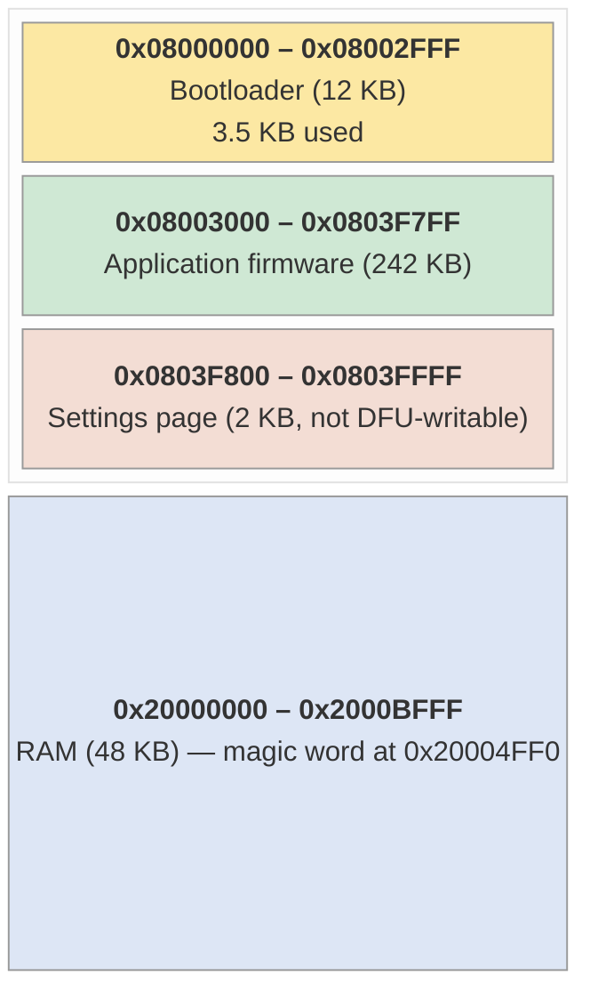
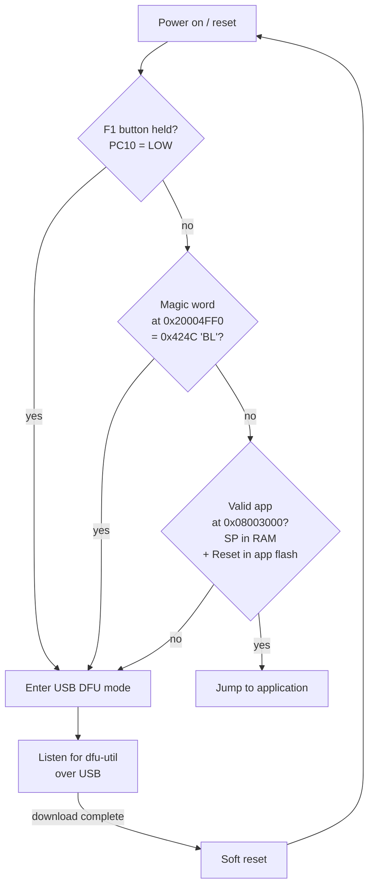

<p align="center">
  <picture>
    <source media="(prefers-color-scheme: dark)" srcset="docs/branding/nv-logo-dark-1024.png">
    
  </picture>
</p>

<h1 align="center">Nova Voyager Open Bootloader</h1>

<p align="center">
  USB DFU bootloader for the <b>Teknatool Nova Voyager DVR</b> drill press
  HMI controller<br>
  <sub>GD32F303RCT6 · 72 MHz + 120 MHz variants</sub>
</p>

<p align="center">
  Companion to
  <a href="https://github.com/Packerlschupfer/nova-voyager_firmware"><code>nova-voyager_firmware</code></a>.
</p>

---

> ⚠️ **Optional replacement.** The OEM Teknatool bootloader is preserved
> by default — `nova-voyager_firmware` flashes only at `0x08003000`
> and leaves `0x08000000–0x08002FFF` untouched. Use this bootloader
> only if you specifically want a fully open boot path.

```
Bootloader binary size: 3.5 KB out of 12 KB allocated
```

---

## What it does

A minimal Cortex-M USB DFU class implementation:

- Identifies as **STMicroelectronics 0x0483:0xDF11** (DFU FS) — works
  with stock `dfu-util`, no vendor tooling required.
- Erases and writes flash from `0x08003000` upward (242 KB writable; the
  last page is reserved for application settings, see below).
- Otherwise stays out of the way: ~3.5 KB used of the 12 KB region,
  the rest is `0xFF` (free for future expansion or recovery payloads).
- Clears flash **write** protection when the option bytes have it set,
  so leftover OEM protection bits can't block a firmware update. Read
  protection is left exactly as it was found: on an STM32F1, taking RDP
  from protected to unprotected triggers an automatic mass erase, and a
  bootloader that wipes your application to be helpful is not helpful.
- Survives a dead 8 MHz crystal: every clock-startup wait is bounded, so
  a crystal that never oscillates falls back to the internal oscillator
  and still boots the application instead of hanging forever.

No LCD, no LEDs, no buzzer. Visual feedback is provided by the USB
host (`dfu-util` shows progress, kernel logs the DFU device).

---

## Memory map



---

## Boot decision flow



A "valid application" is detected by reading the application's vector
table at `0x08003000`:

- **Stack pointer** (`*0x08003000`) must lie within RAM
  (`0x20000000–0x2000C000`, the real top of the 48 KB SRAM)
- **Reset vector** (`*0x08003004`) must lie within the application
  region (`0x08003000–0x0803FFFF`; this check spans the whole region,
  including the reserved settings page, since a vector only needs to be
  plausible, not writable)

If either check fails, the bootloader assumes there is no valid
application and stays in DFU mode.

---

## Updating firmware

### From a running application

The application can request a soft reset into the bootloader by writing
the magic word and resetting:

```c
*(volatile uint32_t*)0x20004FF0 = 0x424C;  // "BL"
NVIC_SystemReset();
```

`nova-voyager_firmware` exposes this as the `DFU` serial command.

### From a powered-off device

1. Disconnect the device.
2. Hold **F1** down, and *keep holding it* while you reset the board.
3. Plug the USB cable into a host PC. The host should see
   `0483:DF11 STMicroelectronics STM Device in DFU Mode`.

The button is sampled in `main()` on **every** reset path, not only at
power-on, so F1 and the reset do not have to be pressed together — hold F1
first and let the reset happen underneath it. That also means a held F1 gets
you into DFU across a soft reset, which is easier to arrange than a
simultaneous front-panel gesture and works when the application is running
but unresponsive.

### From a host with `dfu-util`

```bash
# Verify the device is in DFU mode
dfu-util --list

# Flash an application (firmware.bin from nova-voyager_firmware)
dfu-util --alt 0 --device 0483:DF11 --dfuse-address 0x08003000 \
         --download firmware.bin

# The device resets automatically when DFU completes

# Read the application region back
dfu-util --alt 0 --device 0483:DF11 \
         --dfuse-address 0x08003000:247808 --upload readback.bin
```

A bare `--upload` will not give you the whole region: `dfu-util` refuses
unbound uploads on DfuSe devices and silently limits the read to 16 KB.
The explicit `address:length` form above is required for a full read.

The device advertises `@Flash/0x08003000/121*2Kg` — 121 sectors of 2 KB,
matching the hardware erase page, ending at `0x0803F7FF`.

The last flash page (`0x0803F800`–`0x0803FFFF`) is deliberately outside that
region: `nova-voyager_firmware` stores its settings there, and its linker
already reserves the page (242 KB, not 244 KB), so no legitimate image reaches
it. Leaving it out here means DFU cannot erase saved settings no matter what a
host asks for — see `APP_SETTINGS_RESERVE` in `include/flash_if.h` to change
that.

---

## Differences from the OEM Teknatool bootloader

The OEM bootloader is closed source. Externally observed behaviour
(may change between Teknatool firmware revisions):

| Aspect | OEM | This bootloader |
|--------|-----|-----------------|
| License | Closed | GPL-3.0 |
| Source | Not public | Public (this repo) |
| USB DFU class | Yes (proprietary descriptors observed) | Yes — standard `0483:DF11`, `dfu-util` compatible |
| Mode entry | Unclear / vendor tool required | F1 hold, magic RAM word, or no-app fallback |
| Flash protection | Set on every boot | Write protection cleared when set (read protection preserved) |
| Recovery | Vendor tool only | Any USB DFU host |
| Size | ~12 KB (full region used) | 3.5 KB (8.5 KB free in region) |

---

## Build

Two PlatformIO environments. **The default `nova_bootloader` is the
production target** because USB needs a 48 MHz clock that's only
derivable from the 72 MHz PLL chain.

| Environment | Clock | USB DFU | Size | Use case |
|-------------|------:|:-------:|-----:|----------|
| `nova_bootloader` | 72 MHz | ✅ | 3.5 KB | Production (default) |
| `nova_bootloader_120` | 120 MHz | ❌ | 0.8 KB | Development / profiling — **not usable as a real bootloader** |
| `nova_bootloader_hsefail` | 72 MHz | ❌ | 3.5 KB | Test only — forces the clock-failure path |

```bash
pio run -e nova_bootloader              # default 72 MHz with DFU
pio run -e nova_bootloader -t upload    # flash via ST-Link
```

**`nova_bootloader_120` refuses DFU rather than half-attempting it.** A 120 MHz
PLL cannot produce the 48 MHz that full-speed USB needs — 120/1 and 120/1.5 are
120 and 80. Bringing the peripheral up regardless enumerates a broken device,
which reads as a defective DFU implementation rather than as this build being
incapable of DFU by construction. It now boots the application or stops, so F1
hold and the magic word do nothing there. The USB code links out entirely,
which is why it is 0.8 KB rather than 3.5 KB.

**`nova_bootloader_hsefail` is a diagnostic, not a bootloader.** It never starts
the external oscillator, so `clock_init()`'s bounded `HSERDY` wait polls a
genuinely low ready bit and genuinely times out — the detection runs rather than
being bypassed. Flash it to exercise the clock-failure path on a board whose
crystal is fine, then flash `nova_bootloader` back. It always takes the fallback
and can never reach 48 MHz, so it can never do DFU.

---

## Verification status

Being explicit about what has been exercised, and on what, because "the tests
pass" and "this ran on the hardware" are different claims.

**Host tests** (`tools/run-tests.sh`) compile the shipping `src/usb_dfu.c` and
`src/flash_if.c` natively, with the USB, RCC and flash register windows and the
packet memory redirected to arrays and the application region mapped at its
real address. They exercise the real source rather than a reimplementation, and
cover:

- EP0 control-IN packetisation, including multi-packet transfers and ZLP rules
- descriptor length consistency, and the layout string against the region constants
- DFU upload addressing, including partial and out-of-range blocks
- the DFU **download** path end to end: the DfuSe command sequence, OUT data
  reassembled from 64-byte packets, `GETSTATUS` stepping
  `dfuDNLOAD-SYNC → dfuDNBUSY → dfuDNLOAD-IDLE`, and where `flash_write()`
  actually lands
- the download guards: an `ERASE_PAGE` interleaved between data blocks must not
  move the address pointer, mass erase refused, reserved block 1 stalled, a
  `wLength` above `wTransferSize` refused, and writes aimed at the bootloader
  region or the reserved settings page rejected by the real
  `flash_is_address_valid()`

Each guard has been mutation-tested: reverting the fix it protects makes the
corresponding check fail. They cannot touch anything needing USB silicon.

**Validated on target** (GD32F303RCT6, ST-Link, `dfu-util` 0.11). The image
exercised was `nova_bootloader` with sha256 `44368db6…`; that hash is the
anchor for these results, since it survives history rewrites and a commit
reference does not:

| Behaviour | Result |
|---|---|
| DFU upload, full region | Returns the full requested length, byte-exact against the flashed image |
| DFU download | Byte-exact; readback of DFU-written flash matches source |
| DFU entry via magic word | Enters and stays in DFU |
| DFU entry via F1 hold | Enters DFU and enumerates; confirmed on a software (AIRCR) reset with F1 held |
| Descriptor strings | `Product: Nova Voyager` complete; `@Flash/0x08003000/121*2Kg` advertised |
| Normal boot / app jump | Unaffected by the clock changes |

**Not verified.** These are untested, not known-good:

- The download *guards* have never fired on hardware, only in the host tests.
  A normal `dfu-util` session does not interleave an erase between data blocks,
  send a bare mass-erase, use block 1, or exceed `wTransferSize` — which is why
  they are logic-tested rather than target-tested, and why the ordinary
  download path above is the only part of this exercised on silicon.
- The HSE-failure fallback in `clock_init()`. It has never run.

  It *can* be forced with a build flag, and doing so would exercise detection
  rather than bypass it: `RCC` is reset by both power-on and `SYSRESETREQ`, so
  `HSEON` and `HSERDY` are already clear when `clock_init()` starts. Skipping
  the `HSEON` write leaves `HSERDY` genuinely low, and the real bounded wait
  then polls a real low bit and really times out.

  What no build flag can establish is that a *physically dead crystal* drives
  `HSERDY` the same way. That is documented behaviour for a stopped
  oscillator, but here it is an assumption rather than a measurement. So the
  supportable claim would be "fault response verified with `HSERDY` forced
  low", never "verified against a dead crystal".

---

## Source layout

```
src/main.c       Bootloader entry, mode selection, app jump (assembly)
src/usb_dfu.c    USB DFU class implementation (state machine + descriptors)
src/flash_if.c   Flash erase / write / option-byte helpers
include/         Public headers (DFU spec, flash interface, MCU regs)
bootloader.ld    Linker script — 12 KB at 0x08000000
platformio.ini   72 MHz / 120 MHz build environments
tools/           check-size.sh — reports usage of the 12 KB region
                 run-tests.sh  — host-side EP0 / DFU addressing tests
```

No external dependencies — bare-metal, no HAL, no RTOS. The CMSIS
register definitions are included locally in `include/stm32f1xx.h`.

---

## Hardware target

**GD32F303RCT6** — ARM Cortex-M4F, 256 KB flash, 48 KB RAM. Runs the
STM32F103RC toolchain unchanged at 72 MHz; supports a GD32-specific
PLLx15 multiplier for 120 MHz operation (used only by the `_120` build
environment, not for production).

---

## License

GNU General Public License v3.0 — see [LICENSE](LICENSE).

This bootloader is community-developed. **No warranty.** A bug in a
bootloader can brick a device. Use on your hardware at your own risk.
The provided behaviour (no-app fallback to DFU) is designed to make
recovery from a broken application straightforward, but recovery from
a broken *bootloader* requires an SWD/JTAG programmer.
